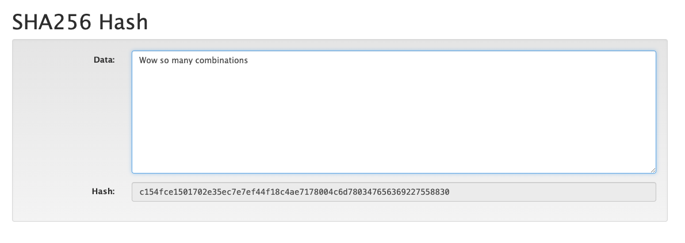
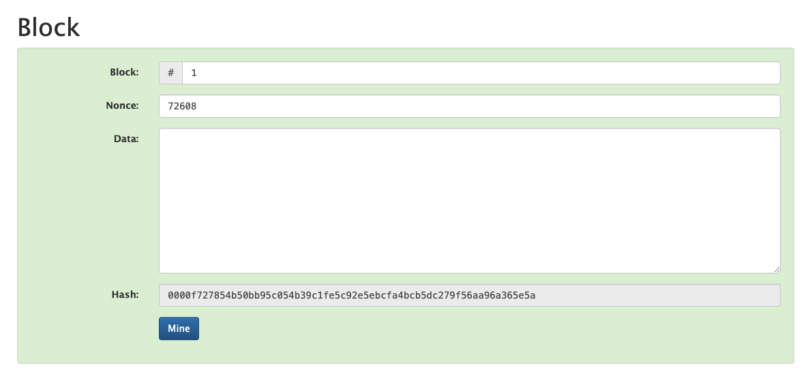
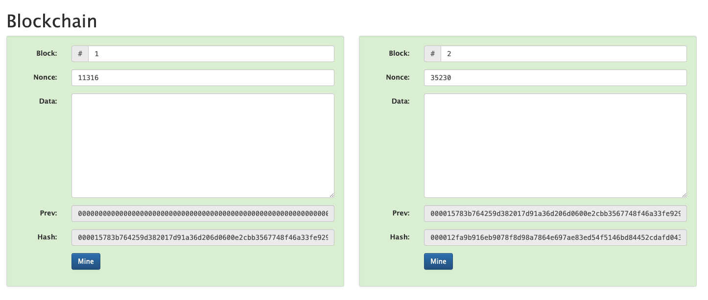
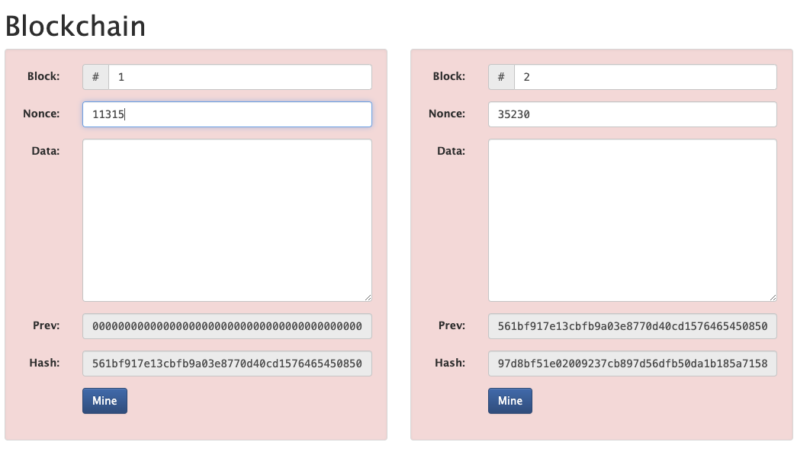
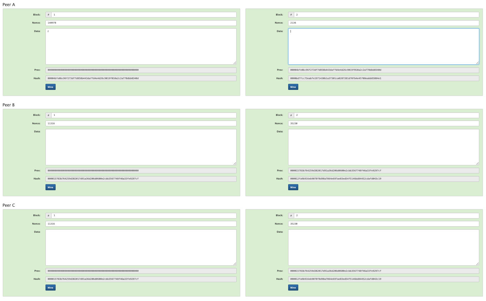
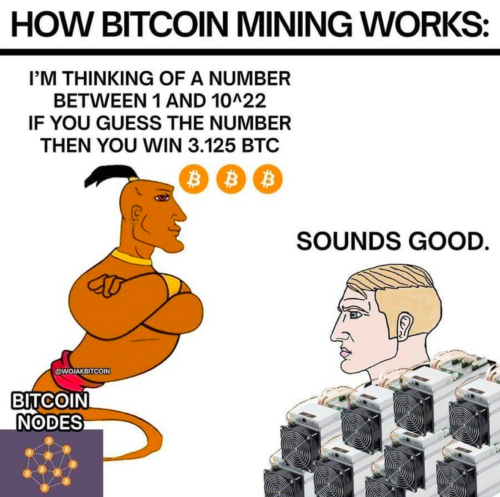

# What is a Blockchain?


Resources Used: 

<Cards>
  <Card title="Bitscan" href="https://btcscan.org/" />
  <Card title="Anders Brownworth Visual" href="https://andersbrownworth.com/blockchain/hash" />
</Cards>


> TLDR : Imagine a blockchain is like an append only, singly linked-list that anyone in the world can see.

# Key Concepts

## Hash 

> A hash is a fingerprint of some digital data. 

Regardless if the input data is 1 char or an entire library, a unique has will be generated
SHA-256(Secure Hash Algorithm 256-bit) produces a fixed-size 256-bit hash value. Since a bit has two possible states (0/1) the total number of possible hash values is:

'''math
2^256 possibilities
'''

```math
c = \pm\sqrt{a^2 + b^2}
```

This property ensures that data within the blockchain cannot be tampered with undetected. You modify 1 character the and the digital fingerprint changes. 



## Block

A block is a container that holds a list of transactions or data records. 

### Data

The data in a block typically refers to the transactions or records that the block stores. 

### Nonce

A nonce is a value used in the mining process to find a valid hash for the block. Its a random number that miners that miners try to guess and find a hash that satisfies the network's difficultly requirements. The nonce is critical for ensuring that the mining process involves proof of work, making the blockchain secure and resistant to tampering. 


### How it ties together
Block number, data, previous block's hash, nonce, timestamp are all hashed to give each block a unique digital signature. 

Hashes begin with 4 0s, if a hash belongs with 4 0s, then the block is "mined". The nonce is adjusted so that it starts with 4 zeros. This means that the miner has successfully solved the Proof of Work challenge. 




## Blockchain

Chain of blocks lol.

Blockchains are "immutable" because if you were to change ANY about a block in the chain, it will change the hash of that mined block, then alter the subsequent blocks. Blocks can only hold 1MB, with the average transaction being 250 bytes, ~4,000 transactions can be stored on a block.



For example, if I change the nonce of the first block fromm 11316 to 11315, this may seem like a small change but this will completely break the chain because the hashes of the current and subsequent blocks are incorrect.



## Distributed System

What if you change a recent block and only have to change the subsequent block, then I have altered a blockchain? Well no, the network is distributed, meaning anyone can see. The network will always accept the majority block hash. In most blockchains, the longest chain is considered the valid one. 



## Mining



### Coinbase

In blockchain terminology, a coinbase refers to a special type of transaction used in the process of mining. It is the first transaction in a block and is created by the miner who successfully mined the block


 