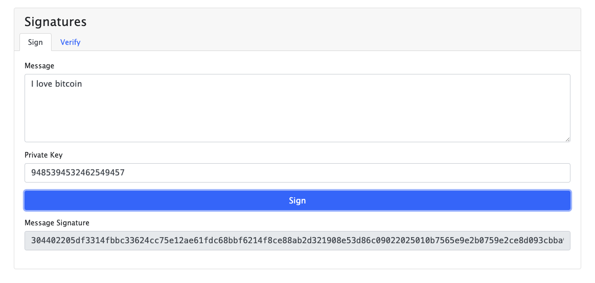
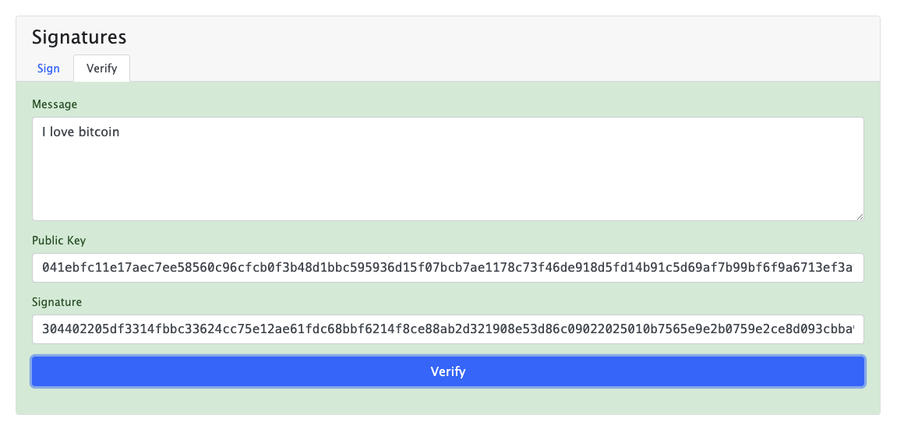
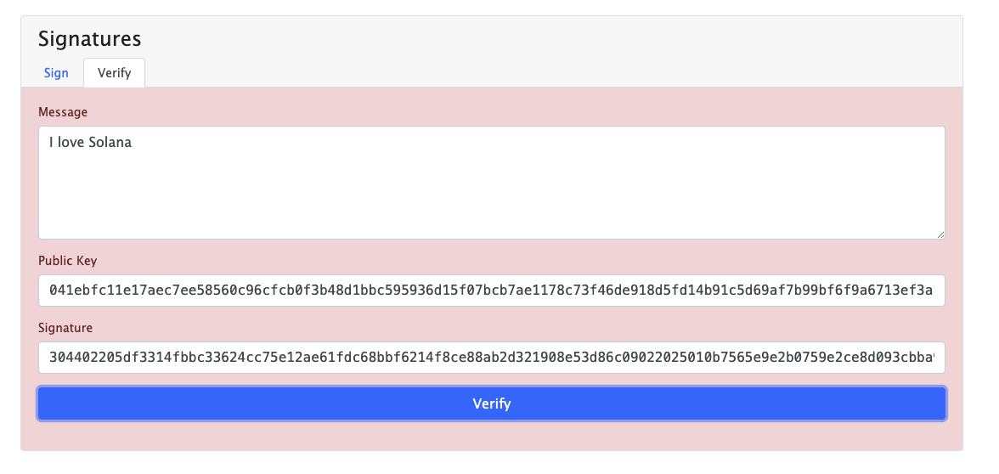
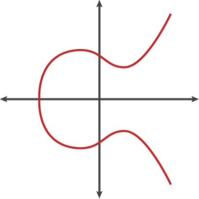
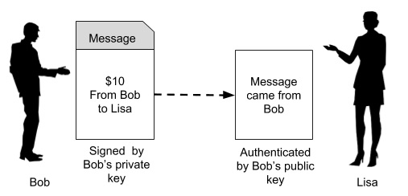

# Understanding Bitcoin Keys and Addresses

Bitcoin uses public/private key cryptography to validate transactions and prove ownership of funds. Let's break down the key components:

<Card title="Anders Brownworth Public-Private Visual" href="https://andersbrownworth.com/blockchain/public-private-keys/keys" />

## Private Key
- A 256-bit number chosen at random by your computer
- Displayed in hexadecimal format for readability
- Must be kept secret - gives complete control over associated funds
- Used to sign transactions to prove ownership
- Can be used to derive the corresponding public key

## Public Key
- Mathematically derived from the private key
- Can be safely shared with others
- Used to verify signatures made with the private key
- Cannot be used to determine the private key (one-way function)

## Bitcoin Address
- Derived from the public key through hashing
- Acts like an email address for receiving Bitcoin
- Can be safely shared publicly
- Used as the destination when sending Bitcoin
- Multiple addresses can be generated from a single public key

The relationship between these components is one-way:

`Private Key → Public Key → Bitcoin Address`

This system allows users to prove ownership and make transactions on the Bitcoin network while maintaining security through mathematical principles.

Given the matching public key, you can can verify the validity of the message sent. 

However, if you change a value for example from Bitcoin to Solana, the message will no longer be valid.

The public key can be generated can be from putting the private key through a <a href="https://www.youtube.com/watch?v=NF1pwjL9-DE&t=66s" target="_blank">Elliptic Curve Digital Signature.</a> secp256k1

## How are wallets generated 

1. Generate a random seed phrase (12-24 words). This seed phrase is a human readable representation of a large random number. It follows the BIP-39 standard, which ensures that each word in the phrase corresponds to specific value from a predefined word list (2048 words)

2. You can derive private keys from the seed phrase from a derivation function like PBKDF2

3. You can derive public keys from private keys

Multiply the Private Key by the Generator Point G: ` P=(x,y)=k⋅G `

k is the private key
G is a fixed generator point (defined in secp236k1)
P is the resulting public key

4. Public key → Hash with SHA-256, then RIPEMD-160 → Add version byte → Generate checksum → Encode with Base58Check → Public address

Base58 is a binary-to-text encoding scheme that is commonly used in Bitcoin. It uses an alhpabet of 58 characters which is the same as normal base64 encoding scheme but omits the characters 0, O, I and l to reduce visual ambiguity. 

## Proof of Ownership

This refers to cryptographic evidence that a specific entitiy controls or owns a particular digital assets. (i.e. in Crypto, NFT and other tokenized assets)
Ownership is proven without needing centralized authorities and instead rely on blockchain's decentralized and transparent ledger.

Given the nature of key pairs, in the context of blockchains, users can sign transactions with their private key and since their public keys are public, anyone can decrypt the message with that given public key. Note that only the public key corresponding the private key will be able to decrypt the message. 

## Cards
