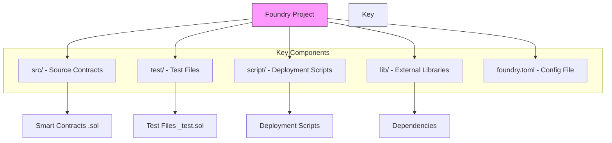

Solidity a high level programming language that is used to create smart contracts, mainly for Ethereum.
It resembles Java and Javascript.

Start by changing into the directory we want to create our foundry project

```
forge init --template https://github.com/foundry-rs/forge-template sc_demo
cd sc_demo
```

Below is a general overview of what the project contains:



Let's navigate to `src/Counter.sol`
You will find a starter template.

```Solidity
// SPDX-License-Identifier: UNLICENSED
pragma solidity ^0.8.13;

contract Counter {
    uint256 public number;

    function setNumber(uint256 newNumber) public {
        number = newNumber;
    }

    function increment() public {
        number++;
    }
}
```

Now to interact with this project, we will need to first deploy the contract first.

However, theres a few steps we need to undertake before we can actually deploy the contract.
